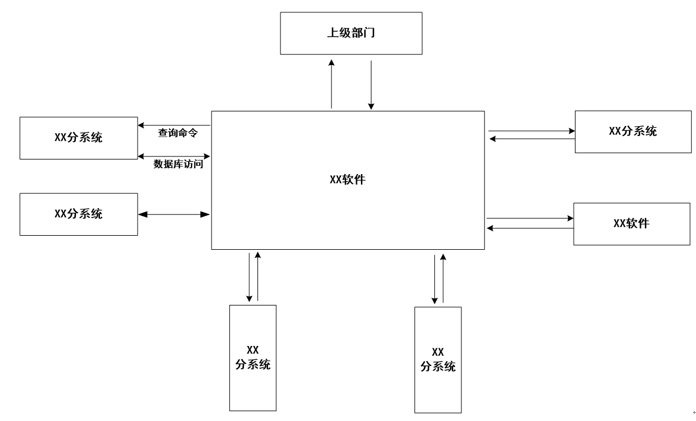

[TOC]

# 范围
## 标识
* 本文档的标识号：公司代号/产品代号/区分号/XQ-01；
* 标题：XXXX需求规格说明；
* 本文档适用于XXX系统/软件/XXXXCSCI。
## 系统概述
标识并描述本文档使用的CSCI（可以是一个系统中的多个配置项）在系统中的作用、运行环境等。包括系统和软件的一般特性；概述系统开发、运行和维护的历史；标识项目的投资方、需方、用户、开发方和支持机构。（备注：描述系统背景、目的及用途等，可参照任务书和系统方案文档。）
# 引用文件
按文档号、标题、编写单位（和作者）和出版日期等，列出本文档引用的所有文件。引用文件表格如下：

|  编号 | 文档名称 | 文档编号 | 编写单位（作者） |  出版日期  |
|-------|---------|---------|-----------------|----------|
|    |   |   |   |   |
|    |   |   |   |   |
[表 2-1 引用文件]
# 总体说明
本章描述影响产品和需求的一般引述，而不叙述具体需求。它提供需求的总体描述和背景，并使它们更易理解。本章内容无需作为需求项进行追踪，详细内容应在后续章节进行描述。
除下述章节外，需求文档中其余易受到关注的内容（如软件产品的可靠性设计等）宜在本章进行总体描述。
## 项目特点分析
* 本文档的标识号：公司代号/产品代号/区分号/XQ-01；
* 标题：XXXX需求规格说明；
* 本文档适用于XXX系统/软件/XXXXCSCI。
## 软件与系统的关系
使用系统框图、数据流图、部署图等各类示意图，描述系统的组成，软件在系统中的位置及与系统中其他软件、硬件的关系。给出软件的运行环境（部署的软硬件环境和对外接口），并描述软件与系统中各软件配置项和硬件配置项间的接口。

[图4.2 流程图]

aaaaa

